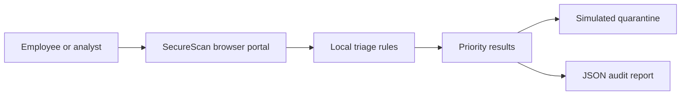
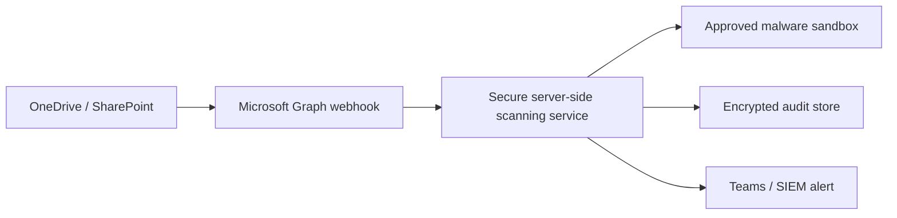

# Architecture and Security Boundaries

## Prototype architecture

## Security boundaries

- The prototype reads selected file metadata and readable text only where the browser permits it.
- Binary files are **not executed**.
- Files are not uploaded to a backend.
- The audit report is downloaded by the user as JSON.
- The prototype does not claim malware detection or real-time cloud monitoring.

## Production target architecture

## Production controls required

- Microsoft Entra ID authentication and role-based access.
- Least-privilege Microsoft Graph permissions.
- Server-side file-size and file-type limits.
- Encryption in transit and at rest.
- Tamper-resistant audit logs.
- A trusted malware-analysis or sandbox provider.
- Incident-response ownership and retention rules.
